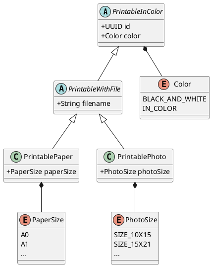
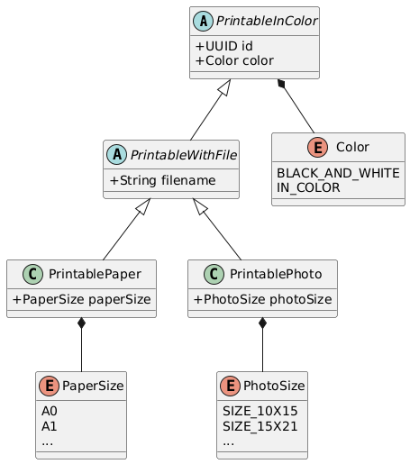
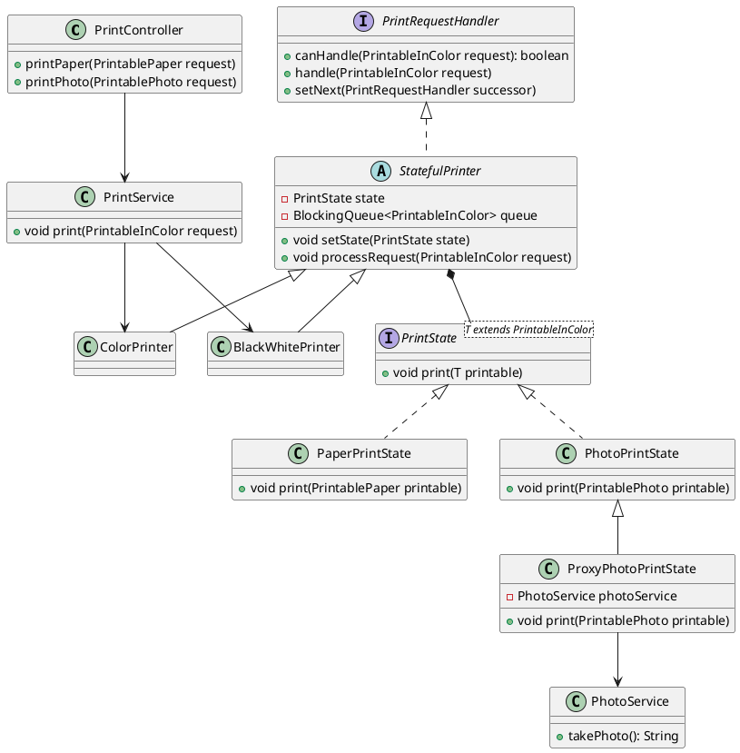
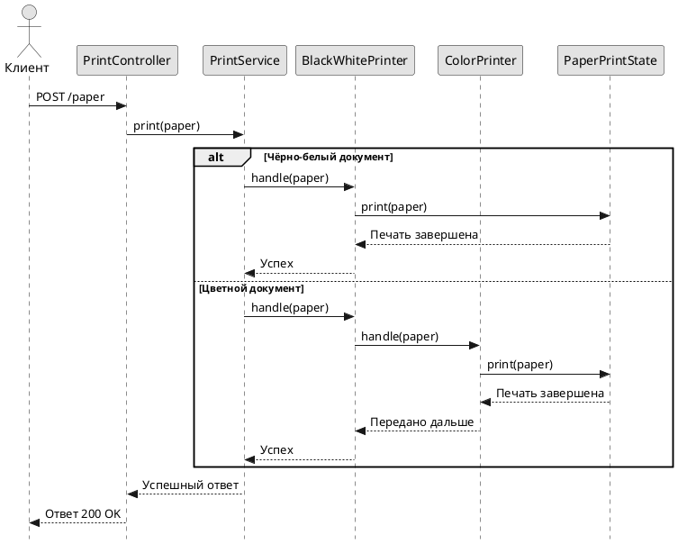
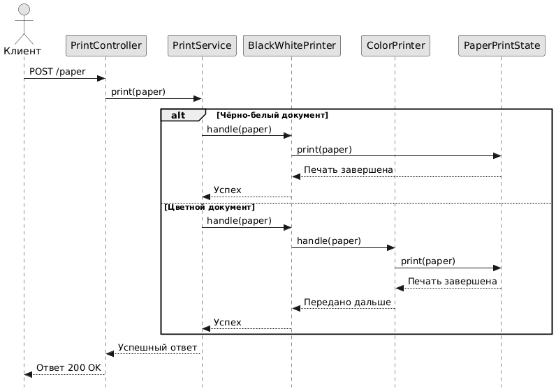
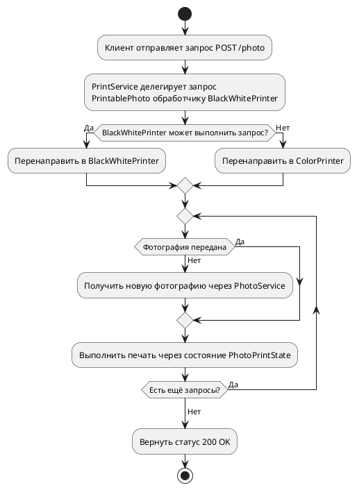
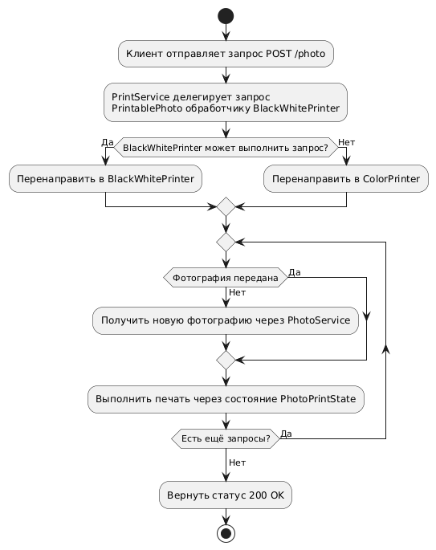

Смоделируйте систему “копировальный сервис”. 

Сервис умеет обрабатывать запросы пользователей (запросы могут поступать не последовательно) на печать 
(фотографии разных форматов, документы формата А4 (например, диплом) в цветном или чёрно-белом варианте и т. д.). 

Для печати по определённому запросу необходимо отправить запрос на определённый принтер 
(первоначально запрос поступает на ч/б принтер, далее на цветной по необходимости (в зависимости от запроса) - примените
шаблон проектирования “цепочка обязанностей”), 

далее настроить целевой принтер под тип документа в запросе (примените паттерн “состояние”) 

и выполнить печать (имитируйте процесс печати ожиданием). 

При печати фотографий рассмотрите варианты, когда в запросе уже есть фотография или же когда её нет 
(когда нет, необходимо проделегировать запрос сервису фотографирования - примените шаблон проектирования “заместитель”). 
Время в системе дискретно. Начальные настройки частей системы должны быть псевдослучайными. 

Продемонстрируйте работу системы. Обеспечьте наглядный вывод информации о процессе работы и результатах работы системы.

